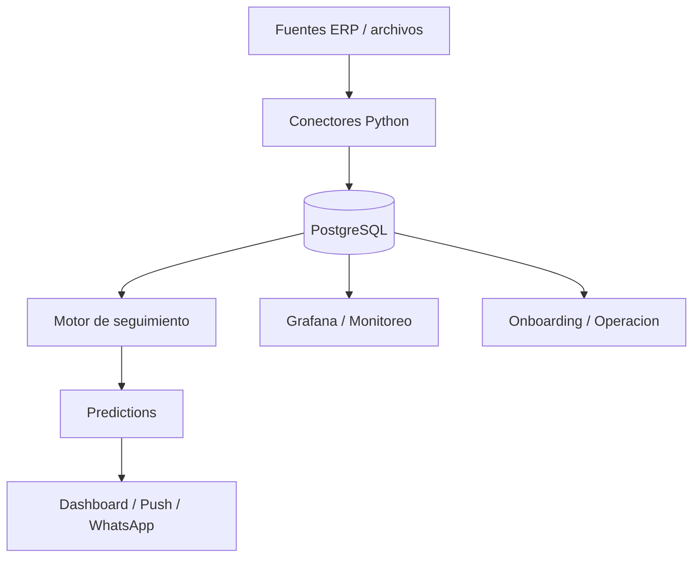

# Mapa del sistema

## Resumen

PymePilot tiene cuatro capas principales:

- entrada de datos: Contabilium, Excel y Google Drive
- motor backend: sync, atribucion, verticales y orquestacion
- persistencia: PostgreSQL con RLS multi-tenant
- salida: dashboard, WhatsApp, Grafana y registros operativos

## Flujo base

## Entrypoints que hay que entender primero

- `backend/main.py`: orquestador diario.
- `backend/scripts/sync_erp.py`: sync manual por tenant.
- `backend/scripts/run_vertical.py`: ejecucion de una vertical.
- `backend/scripts/create_tenant.py`: alta de un tenant nuevo.
- `backend/scripts/route_model.py`: gateway de modelo para tareas del motor.

## Fronteras del sistema

- El frontend no calcula negocio; solo presenta y dispara acciones.
- El backend decide candidatos, genera mensajes y aplica reglas.
- La base de datos es la fuente de verdad para tenants, clientes, pedidos,
  predicciones, attribution y ejecuciones.
- El monitoreo no participa de la logica de negocio, pero si de la
  validacion operativa.

## Orden operativo real

1. Sync de datos frescos.
2. Atribucion de recomendaciones previas.
3. Generacion de nuevas verticales.
4. Push o exposicion al usuario.

Si se rompe ese orden, el sistema puede seguir corriendo, pero la calidad
de la recomendacion baja o queda desfasada.

## Estado actual de modulos

- `seguimiento`: unico modulo productivo hoy.
- `cotizaciones`: base tecnica y de producto en preparacion.
- `portal`: planificado, todavia no es una superficie productiva.
